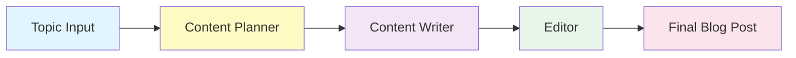
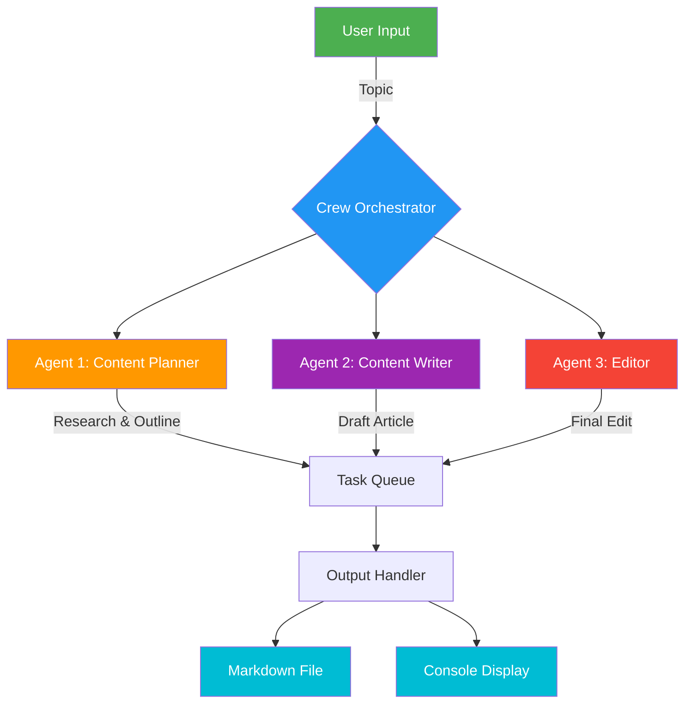
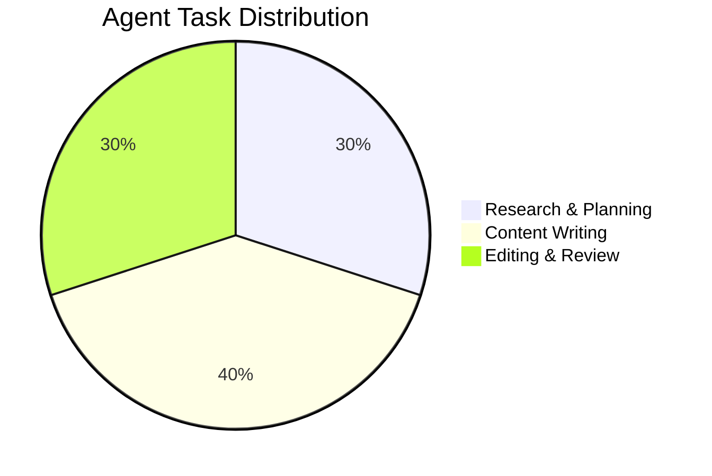

# 🤖 AI AGENT KnowledgeHub

<div align="center">


**A powerful multi-agent AI system for automated content creation using CrewAI**

[Features](#-features) • [Installation](#-installation) • [Usage](#-usage) • [Architecture](#-architecture) • [Contributing](#-contributing)

</div>

---

## 📋 Table of Contents

- [Overview](#-overview)
- [Features](#-features)
- [Architecture](#-architecture)
- [Installation](#-installation)
- [Configuration](#-configuration)
- [Usage](#-usage)
- [Project Structure](#-project-structure)
- [How It Works](#-how-it-works)

---

## 🌟 Overview

AI AGENT KnowledgeHub is an intelligent multi-agent system built with **CrewAI** that automates the entire content creation workflow. The system orchestrates three specialized AI agents that collaborate to research, write, and edit high-quality blog posts on any topic.

### Why This Project?

- ✅ **Automated Content Creation**: Generate complete blog posts with minimal human intervention
- ✅ **Multi-Agent Collaboration**: Specialized agents work together seamlessly
- ✅ **Structured Output**: Consistent, well-formatted markdown content
- ✅ **Extensible Design**: Easy to add new agents and modify workflows

---

## ✨ Features

### 🎯 Core Capabilities

| Feature | Description |
|---------|-------------|
| **Content Planning** | AI-powered research and outline generation |
| **Content Writing** | Engaging, factually accurate article creation |
| **Content Editing** | Professional editing and style consistency |
| **Multi-Format Output** | Markdown, HTML-ready content |

### 🔧 Technical Features

- 🔄 **Sequential Task Execution**: Agents work in a coordinated workflow
- 📊 **Rich Logging**: Detailed execution traces and progress tracking
- 🎨 **Interactive Jupyter Environment**: Easy experimentation and testing
- 🔐 **Secure Configuration**: Environment-based API key management
- 📝 **Verbose Mode**: Optional detailed output for debugging

---

## 🏗️ Architecture

### Agent Workflow



### System Architecture



### Agent Responsibilities



---

## 🚀 Installation

### Prerequisites

- Python 3.10 or higher
- pip package manager
- OpenAI API key

### Step-by-Step Installation

1. **Clone the Repository**
   ```bash
   git clone https://github.com/iitsh/AI-AGENT-KnowledgeHub.git
   cd AI-AGENT-KnowledgeHub
   ```

2. **Create Virtual Environment** (Recommended)
   ```bash
   python -m venv venv
   
   # On Windows
   venv\Scripts\activate
   
   # On macOS/Linux
   source venv/bin/activate
   ```

3. **Install Dependencies**
   ```bash
   pip install crewai python-dotenv jupyter ipywidgets
   ```

4. **Set Up Environment Variables**
   ```bash
   # Create .env file
   cp .env.example .env  # Or create manually
   
   # Edit .env and add your OpenAI API key
   OPENAI_API_KEY='your-api-key-here'
   ```

---

## ⚙️ Configuration

### Environment Variables

Create a `.env` file in the project root:

```env
# OpenAI Configuration
OPENAI_API_KEY='sk-...'

# Optional: Model Configuration
OPENAI_MODEL_NAME='gpt-3.5-turbo'

# Optional: CrewAI Configuration
CREWAI_TRACING_ENABLED=false
```

### Agent Configuration

Agents are configured in `index.ipynb`. You can customize:

- **Agent Roles**: Define the expertise of each agent
- **Agent Goals**: Set specific objectives
- **Backstories**: Add context to agent behavior
- **Delegation**: Enable/disable task delegation
- **Verbosity**: Control output detail level

---

## 💻 Usage

### Quick Start

1. **Launch Jupyter Notebook**
   ```bash
   jupyter notebook index.ipynb
   ```

2. **Run All Cells**
   - The notebook is pre-configured with a complete workflow
   - Simply execute cells sequentially

3. **Generate Content**
   ```python
   result = crew.kickoff(inputs={"topic": "Your Topic Here"})
   ```


---

## 📁 Project Structure

```
AI-AGENT-KnowledgeHub/
│
├── 📓 index.ipynb          # Main Jupyter notebook
├── 🐍 utils.py             # Utility functions
├── 📄 README.md            # Project documentation
├── 🔒 .env                 # Environment variables (not in git)
├── 📋 .gitignore           # Git ignore rules
│
├── 📁 __pycache__/         # Python cache files
└── 📁 .git/                # Git repository data
```

### File Descriptions

| File | Purpose |
|------|---------|
| `index.ipynb` | Main workflow implementation with 3 agents |
| `utils.py` | Helper functions for API key management |
| `.env` | Stores sensitive API keys (excluded from git) |
| `.gitignore` | Specifies files to exclude from version control |

---

## 🔄 How It Works

### The Three-Agent System

#### 1️⃣ Content Planner Agent

**Role**: Research and strategy specialist

**Responsibilities**:
- Identifies latest trends and key players
- Analyzes target audience
- Creates detailed content outline
- Performs SEO keyword research
- Gathers relevant data and sources

**Output**: Comprehensive content plan with structure, keywords, and resources

---

#### 2️⃣ Content Writer Agent

**Role**: Professional content creator

**Responsibilities**:
- Transforms outline into engaging content
- Incorporates SEO keywords naturally
- Creates compelling headlines and subtitles
- Ensures proper structure (intro, body, conclusion)
- Maintains consistent tone and style

**Output**: Well-written blog post in markdown format

---

#### 3️⃣ Editor Agent

**Role**: Quality assurance specialist

**Responsibilities**:
- Reviews for grammatical accuracy
- Ensures brand voice consistency
- Checks journalistic best practices
- Balances viewpoints and assertions
- Avoids controversial content

**Output**: Polished, publication-ready article

---

### Workflow Sequence

```
Topic Input
    ↓
[Agent 1] Content Planner
    → Researches topic
    → Creates outline
    → Identifies keywords
    ↓
[Agent 2] Content Writer
    → Writes full article
    → Incorporates research
    → Optimizes for SEO
    ↓
[Agent 3] Editor
    → Reviews content
    → Corrects errors
    → Finalizes article
    ↓
Final Output: Publication-Ready Blog Post
```

---


### Development Setup

```bash
# Clone your fork
git clone https://github.com/your-username/AI-AGENT-KnowledgeHub.git

# Create development environment
python -m venv venv
source venv/bin/activate  # or venv\Scripts\activate on Windows

# Install dev dependencies
pip install -r requirements.txt
pip install pytest black flake8

# Run tests
pytest tests/

# Format code
black .
```

---

## 📝 License

This project is licensed under the MIT License - see below for details:

```
MIT License

Copyright (c) 2024 AI AGENT KnowledgeHub

Permission is hereby granted, free of charge, to any person obtaining a copy
of this software and associated documentation files (the "Software"), to deal
in the Software without restriction, including without limitation the rights
to use, copy, modify, merge, publish, distribute, sublicense, and/or sell
copies of the Software, and to permit persons to whom the Software is
furnished to do so, subject to the following conditions:

The above copyright notice and this permission notice shall be included in all
copies or substantial portions of the Software.

THE SOFTWARE IS PROVIDED "AS IS", WITHOUT WARRANTY OF ANY KIND, EXPRESS OR
IMPLIED, INCLUDING BUT NOT LIMITED TO THE WARRANTIES OF MERCHANTABILITY,
FITNESS FOR A PARTICULAR PURPOSE AND NONINFRINGEMENT.
```

---

## 📞 Contact

- **Email**: rayane06berrada@gmail.com

---

## 🙏 Acknowledgments

- **CrewAI**: For the amazing multi-agent framework
- **OpenAI**: For providing powerful language models
- **Community**: For contributions and feedback

---

## 🗺️ Roadmap

### Current Version (v1.0)
- ✅ Basic three-agent workflow
- ✅ OpenAI integration
- ✅ Jupyter notebook interface


---

---

<div align="center">

### ⭐ Star this repo if you find it helpful!

Made with ❤️ 

[⬆ Back to Top](#-ai-agent-knowledgehub)

</div>
